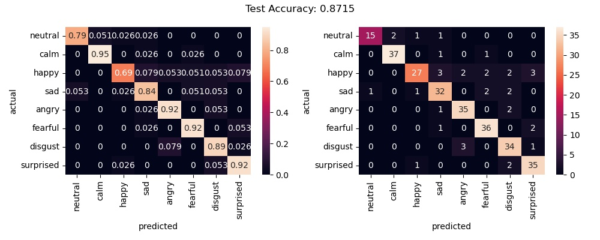
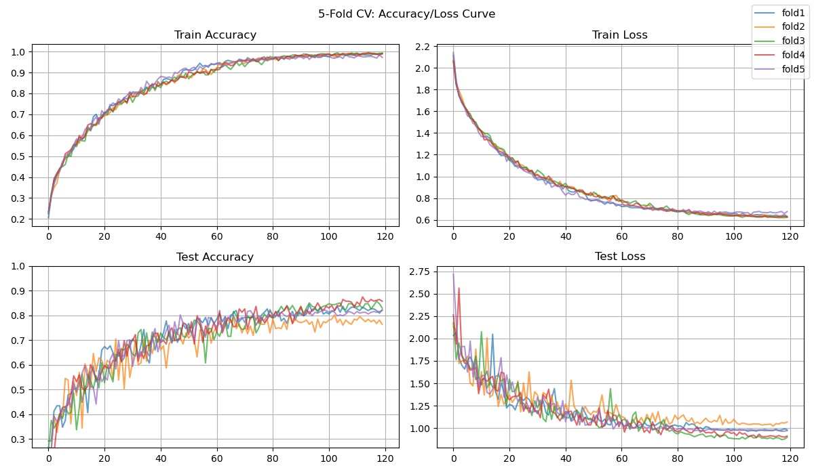
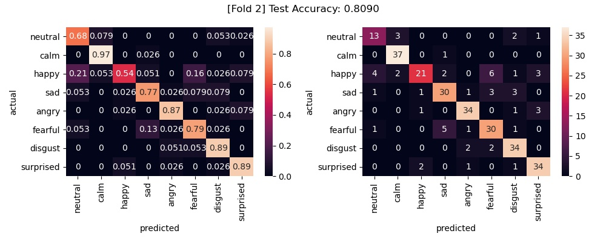
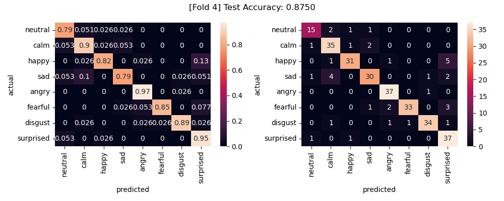
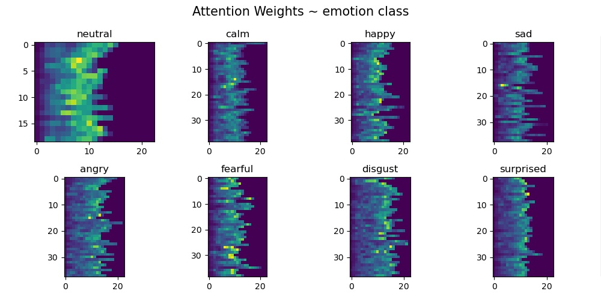
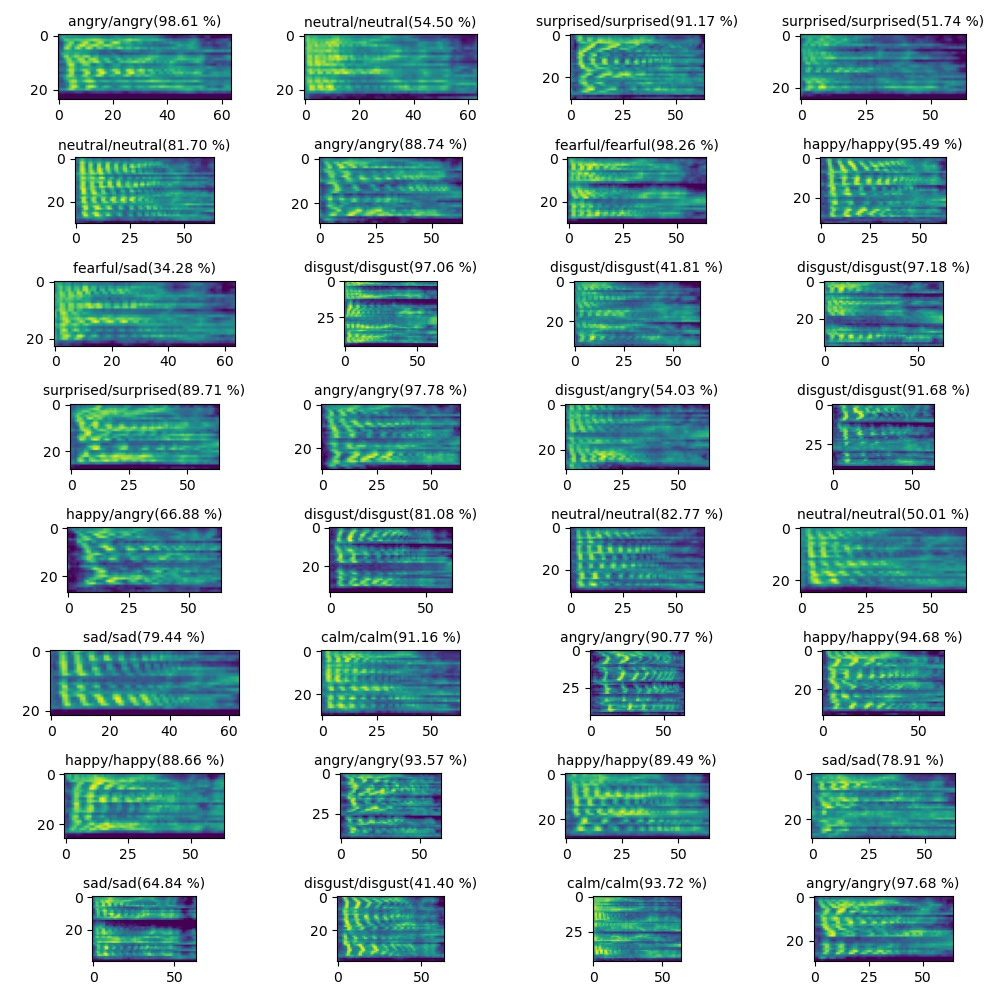

# Speech Emotion Recognition on RAVDESS 😀


#### ✅ This is a CABG(Convolutional Attention based Bi-directional GRU) model named "EmoCatcher".
* Convolutional part includes 3 ```ConvBlock``` for extracting local information from mel spectrogram input.   
   ```ConvBlock``` : ```Conv1d -> ConvLN -> GELU -> Dropout```
* The returned output of Convolutional part goes through ```Maxpool1d``` and ```LayerNormalization```.
* ```GRU``` part extracts global information bidirectionally. ```GRU``` has an advantage in handling variable-length input.
* ```BahdanauAttention``` is applied at the end of ```GRU```. This enables the model to know **where to pay attention.** 
 
#### ✅ Best test accuracy 87.15% on a hold-out dataset. (During the last 10 epochs, mean accuracy was 85.26%).
* train/test dataset with a proportion of 8:2.
* Stratified sampling from the emotion class distribution
* **Mean test accuracy of 84.17(± 2.36)% in Stratified 5-fold cross-validation**

#### ✅ To increase the computational efficiency, VAD(Voice Activity Detection) is applied in the preprocessing stage.
* The start and end points are obtained from power of mel spectrogram.
* This process helps the model to learn features of the voiced region. There cannot be any emotion in the silent regions(before/after speech), hence they are excluded from analysis.


<br>

## RAVDESS Dataset
* Speech audio-only files from Full Dataset
* With 8 emotion classes: neutral, calm, happy, sad, angry, fearful, surprise, and disgust
    * View more dataset information [here](https://www.kaggle.com/datasets/uwrfkaggler/ravdess-emotional-speech-audio)
* Without augmentation or extra-dataset

<br>

## Implementation
* Loss function: ```LabelSmoothingLoss``` ([source](https://github.com/pytorch/pytorch/issues/7455#issuecomment-513062631))
* Optimizer: ```adabelief_pytorch.AdaBelief``` ([source](https://github.com/juntang-zhuang/Adabelief-Optimizer))
* Scheduler: ```torch.optim.lr_scheduler.ReduceLROnPlateau```
* Please check `train.py` for more detailed hyper-parameters.


<br>


## **Performance Evaluation**
### Hold-Out

####  Accuracy & Loss curve

<center>

</center>  
<br>

    Best Test Accuracy: 87.15% / Loss: 0.86552
#### +  Last 10 epohcs (mean ± std)
    Train Accuracy: 0.98881(± 0.00367)
    Train Loss: 0.63214(± 0.00590)

    Test Accuracy: 0.85262(± 0.01182)
    Test Loss: 0.86931(± 0.01257)

* ❗️The mean accuracy during the last 10 epochs may be more reliable to us than a simple best accuracy.

<br>

#### Confusion Matrix
* We can see the confusion matrix(8 x 8). Rows represent the actual emotion classes while columns represent the predicted classes.
* Normalized confusion matrix shows recall for each emotion class. 
* Accuracy metric is the same as WAR(Weighted Average Recall) since I did stratified sampling.


<center>

</center>

* ❗️ We can see that the the model is most confused about the happy class.


<br>
<br>

### 5-Fold CV
Due to the small size of the dataset, there was a concern that the hold-out output might be biased, so I attempted to perform 5-fold cross-validation.

<br>

#### Accuracy & Loss curve
<center>

</center>  

<br>

```
[Fold 1] Best Test Accuracy: 0.84375 / Loss: 0.97918
[Fold 2] Best Test Accuracy: 0.80903 / Loss: 1.04934
[Fold 3] Best Test Accuracy: 0.85764 / Loss: 0.87293
[Fold 4] Best Test Accuracy: 0.87500 / Loss: 0.90747
[Fold 5] Best Test Accuracy: 0.82292 / Loss: 0.98223

[5-Fold CV Best Test Accuracy] max: 0.87500 min: 0.80903 mean: 0.84167 std: 0.02361
```

* ❗️ The mean test accuracy is approximately 84%, which is slightly (almost 3%p) lower than the hold-out result, but overall showing good performance.  
* ❗️ One drawback is that there is significant variation in test performance across folds, which could be due to shuffling of the data, but it could also be a reproducibility issue with the optimizer.  


<br>

#### Confusion Matrix
* The worst-performing and best-performing output are compared through the following figure.
* The confusion matrices for all folds can be found in `/output/cv5/img/`

#### Lowest in the Fold 2
<center>

</center>

#### Highest in the Fold 4
<center>

</center>

* ❗️ There was a significant gap between the highest and lowest values, especially the accuracy for "happy" class was notably low.


<br>


## Outro
* With EmoCatcher, I achieved a test accuracy of 87.15% on a hold-out dataset and mean test accuracy of 84.17% under 5-fold CV.
* I have personally tested this on the CPU. According to the PyTorch documentation, it is not guaranteed that output will be reproducible across different devices. ***Since I haven't conducted many experiments yet, I think more experiments should be carried out to find consistent parameters to increase reproducibility of the above output.***
* There was overfitting of the train data, which was probably due to small dataset size. (Insufficient data size may have made performance estimates noisy.)
 Given the circumstances, it was a good enough performance.
* When I listened and guessed it, my accuracy was about 60%.😅 I think it was difficult to detect emotional characteristics contained in the speech due to cultural differences. (I'm Korean.)  
* So next time, I will challenge Korean Speech Emotion Recognition.

<br>


## Appendix
The following figures are the output of the best model on the hold-out: `output/holdout/model/best_model_0.8715_0.8655.pth`

#### Attention Weights
* We can check which parts the attention mechanism focuses on for each class through the following figure.

<br>
<center>

</center>

#### Predicted Examples
* Plot title format: true emotion class/predicted emotion class(predicted probability x 100 %) 
<br>
<center>

</center>


### + Cite
If you want to use this code, please cite as follows:
```
@misc{hwang9u-emocatcher,
  author = {Kim, Seonju},
  title = {emocatcher},
  year = {2023},
  publisher = {GitHub},
  journal = {GitHub repository},
  howpublished = {\url{https://github.com/hwang9u/emocatcher}},
}
```
